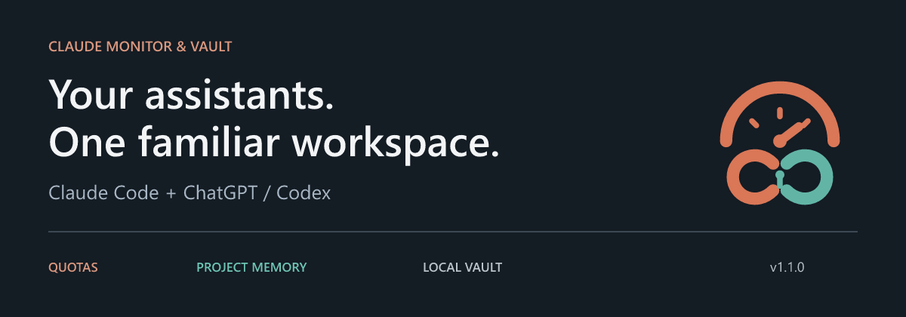
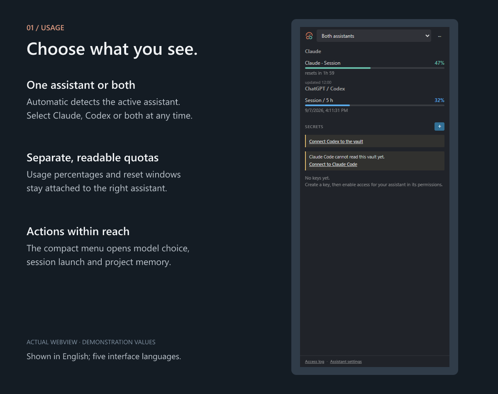
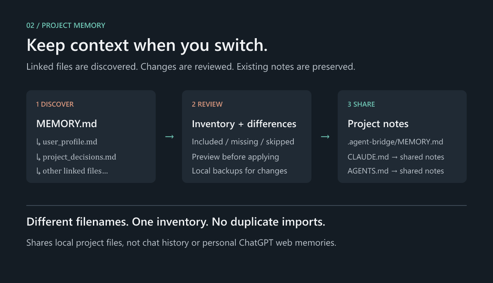

<p align="center">
  
</p>

# Claude Monitor & Vault + ChatGPT

**See your usage. Keep your project context. Control access to your secrets.**

Monitor Claude Code and ChatGPT / Codex quotas from one VS Code panel, choose an
assistant and model for your next session, and share project instructions through
local files. Your familiar Claude Monitor & Vault now includes optional Codex support.

[Install from Visual Studio Marketplace](https://marketplace.visualstudio.com/items?itemName=alexossart.claude-monitor-vault)
 · [User guide](docs/GUIDE.md) · [Release notes](CHANGELOG.md)
 · [Report an issue](https://github.com/DarkHenos/claude-monitor-vault/issues)

**Version 1.1.0** · VS Code 1.106+ · Windows, macOS and Linux · English, French,
Spanish, German and Portuguese.

## One panel for your assistants



The quota selector controls what you see; the actions menu controls what you launch.

| Display mode | Behaviour |
|---|---|
| **Automatic** | Prefers the active assistant tab or terminal, then your saved choice, running terminals, active clients and project instructions. Ambiguous signals can show both. |
| **Claude** | Shows Claude usage counters. |
| **ChatGPT / Codex** | Starts Codex monitoring and shows the connected account's quota windows. |
| **Both assistants** | Shows Claude and Codex quotas together, with separate labels. |

The status bar and activity badge follow your selection. Open **···** for model
selection, session launch, shared memory and vault connection actions.

Both assistants use the same quota bar design. In **Assistant settings**, choose
usage-based or custom Codex colours: normal below 70%, warning from 70%, and
critical from 90%. The settings page includes each displayed assistant's vault
connection and a dedicated Codex connection status.

*The panel image uses demonstration values. Codex counters describe the windows
returned for the connected account, not every limit on the ChatGPT website.*

## Get started

1. Install **Claude Monitor & Vault** from the Extensions view or run:

   ```sh
   code --install-extension alexossart.claude-monitor-vault
   ```

2. Open a local project and the **Claude Monitor** panel from its activity-bar icon.
3. Use your signed-in Claude Code installation. For Codex, install its CLI and
   sign in with `codex login`, then select **ChatGPT / Codex** or **Both assistants**.
4. To start another assistant, open **··· → Switch assistant / model**. Select a
   model, review the proposed memory changes, and launch the new session.

For a downloaded build, use **Extensions → ··· → Install from VSIX** and select
`claude-monitor-vault-1.1.0.vsix`.

## Bring project knowledge to the next session



Import `CLAUDE.md`, `AGENTS.md`, or a memory index such as `MEMORY.md`. The extension
follows linked Markdown files, even when they have different names, and counts
each file once. Before applying, you see included files, missing references,
skipped paths and the proposed changes.

Both assistants receive a reference to **`.agent-bridge/MEMORY.md`**. Imports keep
separate snapshots and preserve their links. Existing notes are retained, and
modified files are backed up locally. Repeating an unchanged import adds no duplicates.

**You remain in control:** memory imports are reviewed before writing files.
It does not merge contradictory instructions, transfer conversation history, or
import personal memories from ChatGPT on the web. Model selection starts a new
CLI session; existing chats retain their own model.

When Codex is detected in a trusted project, basic setup runs automatically:
shared-memory references, vault instructions in `AGENTS.md`, and the local MCP
connection in `.codex/config.toml`. Existing files are preserved and backed up;
unsaved edits or conflicting managed blocks stop setup. Importing other memory
files remains a separate, reviewed action. Start a new Codex session after the
initial setup so it can load the context and tools.

[Read about linked memories, backups and restoration](docs/GUIDE.md#switch-assistants-without-losing-project-knowledge).

## Keep secrets in a local vault

Store keys in an encrypted local vault and grant access to selected tools.
The panel shows key names and policies. Claude uses markers; the Codex connection
provides local MCP tools for listing permitted metadata and running a program
with selected keys in its environment.

By default, Codex can use the same keys as Claude, including newly created keys,
without enabling MCP one key at a time. Expiry, use limits, confirmation and
named-server restrictions still apply. Select **Only MCP-authorized keys** in
**Assistant settings** for stricter access. This setting does not alter existing
key permissions. Restart existing Codex sessions after changing the connection
or access mode. A deliberate disconnection is not automatically undone.

| Capability | Claude Code | ChatGPT / Codex |
|---|---|---|
| Usage monitoring | Session, weekly and model counters | Account quota windows returned by Codex |
| New-session model choice | Default, Sonnet, Opus, Haiku or model ID | Available model catalog, default or model ID |
| Shared project notes | Reference from `CLAUDE.md` | Reference from `AGENTS.md` |
| Local vault access | Hooks, markers and MCP proxy | `vault_list` and `vault_run` through a project MCP connection |

Expiry, optional per-use confirmation, an access log, encrypted backups and
recovery tools are available. Output redaction is best effort; a program receiving
a secret can still transform or disclose it.

[Explore vault setup, recovery and security boundaries](docs/GUIDE.md#claude-vault).

## A familiar extension, updated

Version **1.1.0** adds the unified quota selector, assistant and model switching,
linked project memories, Codex vault tools and a refreshed gauge-and-link logo.
The Marketplace identifier remains **`alexossart.claude-monitor-vault`**; existing
Claude settings, command IDs and encrypted vault files stay in place.

A **What's New** tab explains the update once per version. Reopen it from the
command palette, or choose a notification instead in the settings.

| Setting | Purpose |
|---|---|
| `agentBridge.quotaDisplay` | `auto`, `claude`, `codex` or `both` |
| `agentBridge.syncOnSwitch` | Propose memory synchronization when changing assistants |
| `agentBridge.codexAutoSetup` | Automatically prepare context and the vault connection in trusted projects |
| `agentBridge.codexVaultAccess` | `claude` for Claude-equivalent access, or `mcp` for explicitly authorized keys |
| `agentBridge.updateNotice` | Update tab (`window`), `notification` or `off` |
| `agentBridge.codexExecutable` | Optional absolute path to the Codex executable |
| `claudeLimits.location` | Main or secondary sidebar |
| `claudeLimits.alerts` | Claude quota notifications |

## Requirements and support

- **Local CLIs:** Claude Code and/or Codex must be installed and signed in on the
  host running the extension. API-key-only Codex accounts may not return subscription quotas.
- **Workspace trust:** vault access, Codex and memory synchronization require a
  trusted local project. Claude quota viewing remains available in restricted mode.
- **Remote projects:** in Remote/WSL, the CLIs and vault belong to the extension
  host. Browser-only VS Code and virtual workspaces are not supported.
- **Implementation:** plain JavaScript with no packaged runtime npm dependencies.

For troubleshooting, use the assistant diagnostics command and include your
extension version, operating system and reproduction steps in an
[issue](https://github.com/DarkHenos/claude-monitor-vault/issues).

[Full user guide](docs/GUIDE.md) · [Changelog](CHANGELOG.md) · [MIT license](LICENSE)
