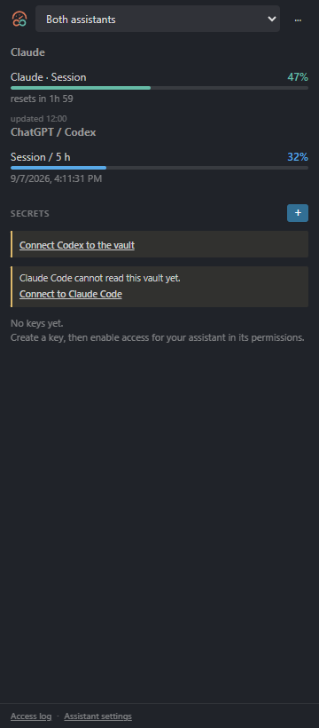

# User guide: Claude Monitor & Vault + ChatGPT

[Back to the overview](../README.md)

**Your familiar Claude Monitor & Vault, now with optional ChatGPT / Codex support.**
Same Marketplace extension, same publisher, same vault and existing Claude settings.
One familiar panel contains a compact quota selector: **Automatic**, **Claude**,
**ChatGPT / Codex**, or **Both assistants**. The **···** menu holds assistant
switching, model selection and shared project memory.

Version **1.1.0** introduces a refreshed logo: the familiar terracotta gauge
paired with a teal link representing connected assistants and shared knowledge.
After installation or an update, a **What's New** tab explains the changes once
per version and links to the new features. Reopen it with **Claude Monitor:
What's New**. Choose `agentBridge.updateNotice` = `window`, `notification` or
`off` to control announcements. If the tab cannot open, a standard VS Code
notification provides the summary instead.

## New: work with Claude Code and ChatGPT / Codex

| Feature | Claude Code | ChatGPT / Codex local clients |
|---|---|---|
| Usage limits | Existing session, week and model counters | Actual account quota windows returned by Codex App Server |
| Model choice | Default, Sonnet, Opus, Haiku or a model ID | Available model catalog, default or a model ID |
| Project memory | `CLAUDE.md` reads shared notes | `AGENTS.md` reads the same shared notes |
| Encrypted vault | Existing hooks, terminal and MCP proxy | Local MCP tools `vault_list` and `vault_run` |

### Switch assistants without losing project knowledge

1. Open the panel's **··· → Switch assistant / model** menu.
2. Choose Claude Code or ChatGPT / Codex, then a model for the next session.
3. Choose shared memory, import project instructions from `CLAUDE.md` or
   `AGENTS.md`, or select a Markdown memory file such as Claude's `MEMORY.md`.
4. Review the file differences and apply. The selected CLI starts in the project.

The common file is **`.agent-bridge/MEMORY.md`**. Both assistants receive an
instruction to read it at the start of their work. Keep project conventions,
decisions, current work and next steps there. Imported notes are appended as
snapshots, not silently rewritten or semantically merged. Native files retain
their existing assistant-specific instructions. Review contradictory notes before
continuing; scoped rules remain scoped and are not automatically flattened.

**Linked memory files are included.** Importing an index follows local Markdown
links, reference-style links, `@file.md` imports, backtick-quoted paths and plain
Markdown filenames in the text. A file such as `MEMORY.md` can point to
`user_profile.md`, `feedback_style.md` or `project_decisions.md`; each of those is
scanned in turn. Cycles and duplicate references count a file only once.

Before applying, an inventory shows the index, every included file, the total
count, missing files and skipped references. Included linked files stay separate
under `.agent-bridge/imports/`, with relative links rewritten for the new location.
Identical imports are idempotent. Changed source files create a new snapshot,
preserving previous imported notes, and edits during preview require a new scan.

Project imports stay within the project. An explicitly selected memory index
outside the project can include files in its own folder and subfolders. Links
outside that scope and symbolic links are reported as skipped; network links are
never fetched. Scans are bounded at 128 files, 20 link levels, 256 KB per file and
4 MB in total; a reached limit is reported, not silently treated as complete.

Existing files are backed up under VS Code's extension storage before each
change. **Restore last project change** restores the latest batch if the files
have not changed again. Edited managed blocks, `AGENTS.override.md`, symlinks,
unsaved affected documents and stale previews stop synchronization instead of
overwriting work. Multi-folder workspaces prompt for the project to use.

**Scope:** the selector starts a new CLI session in VS Code's terminal. It does
not change the model in an already running Claude or Codex chat, transfer a chat
transcript, or synchronize the personal memory of ChatGPT on the website. Native
automatic memories and their linked files are imported when you select their index; ongoing shared
knowledge belongs in `.agent-bridge/MEMORY.md`. No API calls generate summaries.

### Enable ChatGPT / Codex usage monitoring

Install Codex CLI, sign in with `codex login`, then select **ChatGPT / Codex** or
**Both assistants** at the top of the panel. Monitoring starts automatically.
**Automatic** prioritizes the active assistant tab or terminal, then the saved
project choice, running terminals, native instructions and client signals;
existing users who enabled Codex monitoring keep both providers visible.
Monitoring uses the Codex App Server account
interface. It displays returned percentages, window durations, reset times and
the last update. Failed refreshes keep the last values with a warning.

The counters describe the quota buckets returned for the connected Codex account;
they are not a promise to cover every limit on the ChatGPT website. API-key-only
accounts do not provide subscription quotas. CLI discovery supports native
executables and standard npm installs; custom installations can use
`agentBridge.codexExecutable` or `agentBridge.claudeExecutable`.

### Use the vault from Codex

Codex detection automatically prepares context and the vault connection in trusted
projects. Disable this with `agentBridge.codexAutoSetup`. Manual **Connect Codex to
the vault** remains available. The extension preserves and backs up a
managed MCP entry in the project's `.codex/config.toml`, preserving other settings.
The default `agentBridge.codexVaultAccess = claude` permits the same keys as Claude.
Use `mcp` to require explicit MCP permission per key. Named-server restrictions,
expiry and confirmations remain enforced. Start a new Codex session after setup
or a change of access mode. Existing key permission records are not rewritten.

The server exposes metadata through `vault_list` and runs a program through
`vault_run`, mapping vault key names to environment variables. It buffers and
redacts output before returning it. It does not return secret values as a tool.
Programs run in the connected project, without shell expansion, with a 60-second
timeout and a 1 MB output limit. This is a separate tool path; it does not rewrite
arbitrary Codex shell calls. Existing Claude hooks continue to work as before.

Codex vault access requires VS Code to remain open when a key needs per-use
confirmation. Use **Disconnect Codex from the vault** to remove the managed entry.
The encrypted store stays at its existing location so this update does not move
or duplicate existing secrets. Codex uses are identified in the access log.

### Compatibility and updates

- Marketplace ID remains **`alexossart.claude-monitor-vault`**.
- Existing settings and command IDs remain supported.
- Claude integration remains enabled as before; Codex monitoring is opt-in.
- Local trusted projects are required for vault access, assistant launch and
  memory synchronization. Claude quota viewing remains available in restricted mode.
- Windows, macOS and Linux CLI paths are supported. Browser-only VS Code and
  virtual workspaces are not supported. In Remote/WSL, CLIs and the vault belong
  to the host running the extension.

Implementation references: [Codex App Server](https://learn.chatgpt.com/docs/app-server),
[MCP configuration](https://learn.chatgpt.com/docs/extend/mcp?surface=cli),
[AGENTS.md](https://learn.chatgpt.com/docs/agent-configuration/agents-md).

## Existing Claude features

The original two tools remain available:

1. A live view of your Claude usage limits, the same numbers as Claude Code's
   `/usage` command.
2. **Claude Vault**, an encrypted local secret store that Claude Code can use
   without ever seeing the values.



Preview of version 1.1.0 with demonstration values. Use the selector to display
Claude, ChatGPT / Codex, or both; the compact menu opens assistant and memory actions.

## Install

Search for **Claude Monitor & Vault** in the Extensions view, or:

```
code --install-extension alexossart.claude-monitor-vault
```

To install a `.vsix` yourself:

```
code --install-extension claude-monitor-vault-1.1.0.vsix
```

Requires **VS Code 1.106** or newer. Plain JavaScript, no runtime dependencies.

## Getting started

1. Open the panel from the activity-bar icon on the left.
2. Press **+** in the Secrets section and paste a key. It is encrypted on submit.
3. Ask Claude to use it by name:

   ```
   you>  list my private repositories with $GITHUB_TOKEN
   ```

   Claude writes a marker into its command; the value is substituted at the last
   moment, out of its view:

   ```bash
   curl -H "Authorization: Bearer {{vault:GITHUB_TOKEN}}" https://api.github.com/user/repos
   ```

4. A backup file is created for you at first launch and follows the vault from
   then on. Press **Create the backup key** in the box above the access log and
   write down the 17 words: that is what makes the backup openable on another
   machine, and what brings the vault back if this one loses its master key.

## Usage monitor

| | |
|---|---|
| Panel | one row per limit (session, week, per model), bar, percentage, countdown |
| Activity-bar badge | session percentage on the icon, wherever the panel sits |
| Status bar | compact figure such as `session: 8%`, full breakdown on hover; two styles: **Prominent** (default coloured pill, amber then red) or **Custom** (text only, colour band configurable per session %) |
| Band editor | in Custom mode only, drag boundaries or type percentages; built-in preview scales the text colour as you edit |
| Alerts | at 80% then 95% of the session, 90% of the week, once per reset window |
| Smart pause | when a limit is exhausted, calls stop until the reset time |
| Projection | `full ≈ 17:40` when the slope says a quota runs out before it resets |
| Shared cache | one real request feeds every open VS Code window |

The extension reads Claude Code's local OAuth token from
`~/.claude/.credentials.json` (the macOS keychain when that file is absent) and
calls `api.anthropic.com/api/oauth/usage`, the endpoint `/usage` uses. On HTTP
429 it backs off, honouring `Retry-After`, and keeps the last known figures on
screen.

## Claude Vault

**Claude never gets your keys, it gets the right to use them.** The key stays in
the vault, the vault uses it on Claude's behalf, and the plaintext only ever
exists in the memory of the process that needs it.

### Markers

| Marker | Replaced by | Typical use |
|---|---|---|
| `{{vault:NAME}}` | the value, inline | `Authorization` headers, environment variables |
| `{{vault-file:NAME}}` | the path to an ACL-restricted temporary file | `ssh -i`, certificates, JSON service accounts |

Type `{{vault:` in any file or terminal and the editor offers your key names.

In a shell command the marker is not replaced by the value but by a call to a
helper carrying a **single-use token valid for two minutes**. The value is
fetched at the instant the command runs, in that process only. It appears in no
stored string: not the transcript, not the rewritten tool input, not the shell
history. Replaying the command yields nothing.

### The vault terminal

For anything long-running, a dev server, a watcher, a container, use a terminal
whose environment already holds the keys, so no value ever reaches a command
line:

```
Ctrl+Shift+P  >  Claude Vault: Open a vault terminal
```

Pick the keys, and they arrive as environment variables named after them. Your
`.env` can leave the disk. The extension never holds the values itself: it puts
markers in the terminal's environment and lets the vault's launcher resolve
them.

### Recovery, backup and moving machines

The master key is 32 random bytes held by your OS secret store, unique to this
machine. Two things make it survivable:

- **Recovery phrase.** 17 words, shown once and stored nowhere, that unlock a
  copy of the master key. Needed if the OS secret store is ever lost: a wiped
  profile, a reinstalled system, a rebuilt account.
- **Backup file** (`.cvault`). One encrypted file holding the whole vault: the
  keys, the access log, the bin and your settings. It is created on first launch
  and rewritten at every change, so it is never out of date. Move it wherever
  you like, the new location is remembered.

The two work together. This machine can always open the backup file, which
covers a deleted or corrupted vault. Once a recovery phrase exists, the same
file also opens on **any** machine, which is what a dead disk or a new computer
actually needs. Keep a copy somewhere other than this machine.

Moving to a new computer is the file plus the words:

```
Ctrl+Shift+P  >  Claude Vault: Restore from a file
```

### Deleting, renaming, replacing

- A deleted key waits **30 days in the bin**, still encrypted, and comes back in
  one click. There is an **Undo** on the confirmation itself.
- Renaming normalises spaces and accents: `github key 1` becomes
  `GITHUB_KEY_1`.
- Replacing a value never displays the previous one, and keeps the expiry, the
  limits and the authorisations.

### Lifetimes

No expiry, 5 minutes, 1 hour, 8 hours, 24 hours, 7 days, or **burn after first
use**. The expiry is part of the encryption's authenticated data: editing it in
the file makes the secret undecryptable rather than extended.

### Public or secret

Services publish half of a pair on purpose: a Stripe `pk_`, a Supabase anon key,
a captcha sitekey. Those are detected at creation and marked public, which keeps
the commit guard from warning about them. Detection is deliberately narrow, and
the name is never a signal: `PUBLIC_KEY` is what half the world calls the
counterpart of a private one.

### Ask before every use

Off by default. Turned on for a key, every use by Claude raises a dialog and the
command waits for it. No answer within a minute means refused. Meant for the few
keys where an unattended use would be expensive.

### Commit guard

Warns when one of your own secrets appears in clear in a saved file or in what
you have staged for commit. It compares fingerprints, so nothing is decrypted
and there are no false positives. Keys marked public are skipped.

It warns and never blocks, on purpose: blocking would mean a git hook, and a git
hook is triggered by the repository, so any project you clone could ask it
whether a string is one of your secrets.

```
Ctrl+Shift+P  >  Claude Vault: Check what is staged for commit
```

### What Claude can do on its own

Two actions, both safe by construction.

**List the key names.** Metadata only, no path to a value.

```
node ~/.claude/claude-vault-bridge/list.js
```

**Create a key.** The value arrives through a pipe, so it never passes through
the model or the transcript. The name comes from the command line, the value
only from stdin, and a description is required.

```
openssl rand -hex 32 | node ~/.claude/claude-vault-bridge/add.js SESSION_SECRET --note "signs the API session cookies"
```

An existing key is never replaced without approval: `--replace` seals the new
value and parks it until you approve in VS Code. **Deletion is always yours**,
Claude has no path to it.

### How it is encrypted

- **Master key**, 32 random bytes, held by the OS secret store: DPAPI
  `CurrentUser` on Windows, the login keychain on macOS, libsecret on Linux. A
  keyring that stores its contents in the clear is refused and the panel says
  so.
- **Per secret**, a key derived with HKDF-SHA256, AES-256-GCM, a fresh 12-byte
  IV and salt on every write.
- **Authenticated data** covers the entry's id, name, expiry, policy and its
  MCP, public and confirmation flags. Editing any of them in the file breaks
  decryption instead of granting anything.
- **Whole-file HMAC** plus a monotonic counter sealed in the key file: entries
  cannot be added, removed, swapped or rolled back.
- The value never travels through a command-line argument, so it never appears
  in the process list.

### How Claude Code reaches it

**Connect to Claude Code** installs four hooks into `~/.claude/settings.json`,
through a non-destructive merge with a timestamped backup. Idempotent and
reversible with **Disconnect**.

| Hook | Role |
|---|---|
| `SessionStart` | announces the names of the available keys |
| `UserPromptSubmit` | detects `$NAME`, injects metadata and instructions |
| `PreToolUse` | substitutes markers in shell and MCP calls |
| `PostToolUse` | redacts vault values from tool output |

No hook touches the master key: they read metadata only.

### MCP servers

**Environment launcher.** A launcher resolves the marker into the server's
environment before it starts. `.mcp.json` holds a marker instead of a key, so it
can be committed.

**Transparent stdio proxy.** For a value that has to be a tool argument, a proxy
sits between Claude Code and a local stdio server. Claude Code persists and
replays the marker; the substitution happens downstream, and any echo of the
value in the response is redacted on the way back. Local stdio servers are
wrapped automatically.

Authorisation is per key, and can be restricted to **named servers**: the key is
refused everywhere else.

**The honest limitation.** A remote HTTP server that receives the value as a
tool argument writes it into the transcript; there is no local process to put it
behind. That path is off by default and gated per key.

### Output redaction

Some providers echo back what you sent: an error quoting the offending token, a
`curl -v` dumping the authorization header. After each tool call, a pass masks
any known vault value in the output, covering the raw value, base64,
URL-encoding and HTTP Basic pairs. Best effort: it does not cover a value the
command transformed on its own.

### Access log

Every use, creation, replacement, expiry and revocation is recorded with the key
name, the time and **who acted**, Claude or you. Never the value. Bounded at 500
entries and 90 days: long enough to investigate, short enough that the file
forgets on its own.

### What it does not protect against

- **Malware running under your own account** has the same access you do. No
  passphrase-free vault can prevent that; zero friction is the deliberate
  choice, and this is its price.
- **Expiry is not destruction.** It prevents extending a key, not copying the
  file before the deadline.
- **A command can betray a secret itself**, by encoding it, splitting it, or
  writing it to a file read back later.
- **Memory wiping is best effort.** JavaScript strings are immutable.

## Commands

All available from the command palette, prefixed **Claude Vault** or **Claude
limits**.

| Command | What it does |
|---|---|
| Open a vault terminal | a terminal whose environment holds the chosen keys |
| Create the backup file | one encrypted file, kept up to date on its own |
| Restore from a file | bring a vault in, on this machine or a new one |
| Create the backup key | generate the 17-word recovery phrase |
| Recover with a phrase | reopen the vault when the OS secret store is lost |
| Open the bin | put back a key deleted in the last 30 days |
| Check what is staged for commit | look for your secrets in the staged diff |
| Rename a key / Replace the value | without ever showing the old value |
| Public or secret | stop watching a publishable value, or resume |
| Ask before every use | require a confirmation for one key |
| Connect / Disconnect | wire Claude Code, or restore it exactly |
| Access log | who used what, and when |
| Revoke everything | new master key, every secret unreadable, immediately |

## Settings

| Setting | Default | What it does |
|---|---|---|
| `claudeLimits.location` | secondarySidebar | where the panel lives, `secondarySidebar` (right, next to the chat) or `sidebar` |
| `claudeLimits.autoConnect` | true | wire Claude Code at startup; off, nothing is touched until you press Connect |
| `claudeLimits.pollSeconds` | 210 | seconds between API calls, minimum 120 |
| `claudeLimits.alerts` | true | threshold notifications |
| `claudeLimits.statusBar` | true | show usage in the status bar |
| `claudeLimits.statusBarPosition` | right | which side of the status bar shows the figure |
| `claudeLimits.statusBarStyle` | prominent | `prominent`: coloured pill at all times (amber then red). `subtle`: text colour follows your band settings, no pill. |
| `claudeLimits.statusBarBands` | `[{upTo: 50, color: "descriptionForeground"}, {upTo: 75, color: "foreground"}, {upTo: 90, color: "charts.yellow"}, {upTo: 100, color: "charts.red"}]` | colour band thresholds for Custom mode: each band runs up to its percentage, the next one starts there (no gaps or overlaps). Configurable from the settings page. Colours come from the theme, so they stay readable in light and dark. |
| `claudeLimits.statusBarWeek` | false | also show the weekly limit |
| `claudeLimits.badge` | true | numeric session badge on the activity-bar icon |
| `claudeLimits.pauseWhenExhausted` | true | stop polling until the reset time |
| `claudeLimits.showCredits` | true | show paid credits beyond the plan |

All of them are editable from the gear icon in the panel's title bar.

## Open source, local by design

Every line this extension runs is public:
**[github.com/DarkHenos/claude-monitor-vault](https://github.com/DarkHenos/claude-monitor-vault)**

- **No extension telemetry, no server of ours.** Claude monitoring calls
  Anthropic's usage endpoint. Optional Codex monitoring uses the locally installed
  Codex CLI and its service connections. The CLI has its own settings and policies.
- **Local encrypted storage.** The vault is encrypted with a key sealed by your
  OS session. Authorized programs can transmit credentials to the services they
  authenticate with. Output redaction reduces exposure to the model; it is not a
  sandbox against malicious commands or arbitrary secret transformations.
- **MIT-licensed.** Audit it, fork it, build the `.vsix` yourself and compare.

Interface in English, French, Spanish, German and Portuguese, chosen in the
panel's settings window, independently of the VS Code display language.

## License

MIT.
